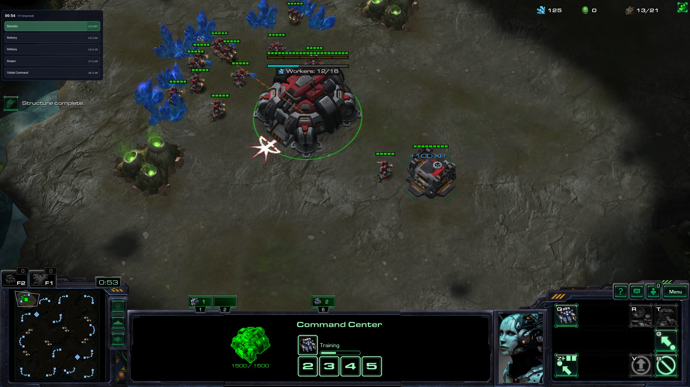
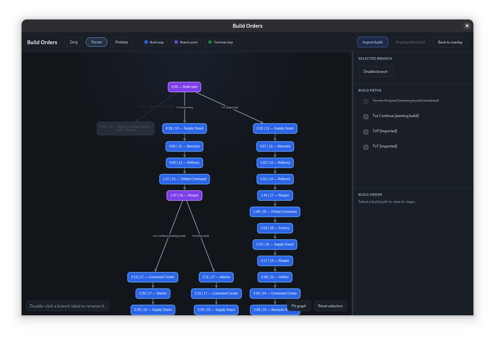
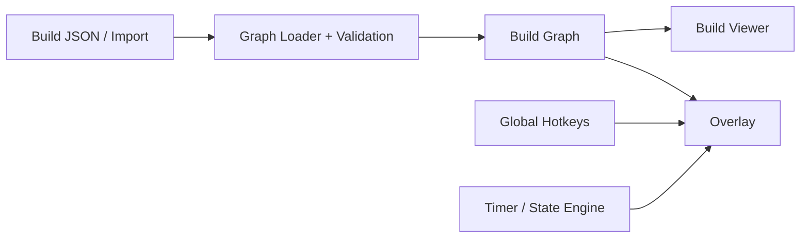

# SC2 Overlay

[](https://github.com/Andrew50/sc2-overlay/actions/workflows/ci.yml)

SC2 Overlay is a cross-platform Electron desktop app for following branching StarCraft II build orders while you play.



An always-on-top, optionally click-through Electron window shows a live game timer and the next few actions. When a build forks on a scout read, you pick a branch with global hotkeys and the overlay continues down that path.

## Highlights

- **Shared-prefix build graphs** — common openings stay as one path and branch only when build orders actually diverge.
- **Spawning Tool / SALT import** — parses linear build orders, finds the longest compatible path in the existing graph, and previews the resulting merge before modifying local data.
- **In-game overlay controls** — global hotkeys choose branches, scrub the timer, and jump steps while StarCraft II has focus, including Linux Wayland/X11 handling in the Electron main process.
- **Build viewer** — Cytoscape visualization of the full graph with path inspection, editable decision labels, branch enable/disable controls, and practice mode.
- **Packaged desktop app** — Vite and electron-builder produce Linux, macOS, and Windows artifacts, with GitHub Actions handling CI and release builds.



## Architecture



Build data is authored as compact JSON trees under `builds/`: timed action steps and decision nodes with up to three options. Related builds share a common opening and only branch where the order actually diverges.

The loader validates files against JSON Schema, resolves cross-file references, and produces one graph per player race. The overlay and build viewer both consume that resolved graph; global hotkeys and the timer drive overlay state while you play. Authoring rules live in [BUILD_FORMAT.md](BUILD_FORMAT.md).

**Stack:** TypeScript · Electron · Vite · Cytoscape · AJV / JSON Schema

## Running locally

Requires Node.js 22+ (CI uses 22).

```bash
npm ci
npm run dev          # Electron overlay + Vite
```

Build JSON is local and gitignored. Packaged installs seed from `seeds/builds/`. For local development you can start empty (the app launches with no races) or copy the seed:

```bash
mkdir -p builds && cp seeds/builds/starter.json builds/
```

Then import real builds from the viewer (F9) or:

```bash
npm run import-build -- --help
```

Other useful commands:

```bash
npm run view             # build viewer in the browser
npm run typecheck
npm test
npm run validate:data    # load config + resolve build graphs
npm run builds           # print every root→leaf path
npm run dist             # package for the current OS
```

## Tests

```bash
npm test
```

Covers action normalization, Spawning Tool/SALT parsing, merge/divergence behavior, graph rendering for race-root decisions, and decision-label updates. CI runs typecheck, tests, and data validation on pushes and pull requests to `main`.

## Project layout

- `electron/` — main process: windows, global shortcuts, IPC, packaged data bootstrap
- `src/renderer.ts` — overlay UI and timer / decision flow
- `src/viewer/` — build-order graph UI
- `src/core/` — loader, graph traversal, import/merge, branch/label mutations
- `schemas/` — JSON Schema for config and compact build files
- `seeds/builds/` — bundled first-run scaffold
- `scripts/` — CLI import, validation, path dumping
- `tests/` — unit tests and fixtures

## Releases

Tag `v*` (or run **Publish Release**) to build Linux/macOS/Windows installers and attach them to a GitHub Release. **Build Desktop Artifacts** produces the same packages without publishing.
